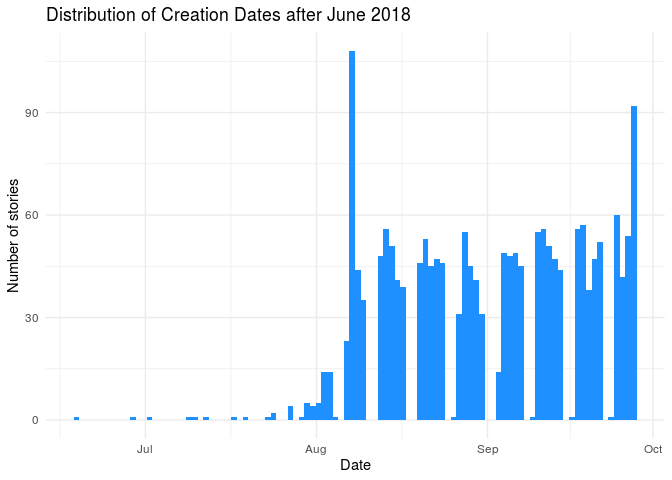
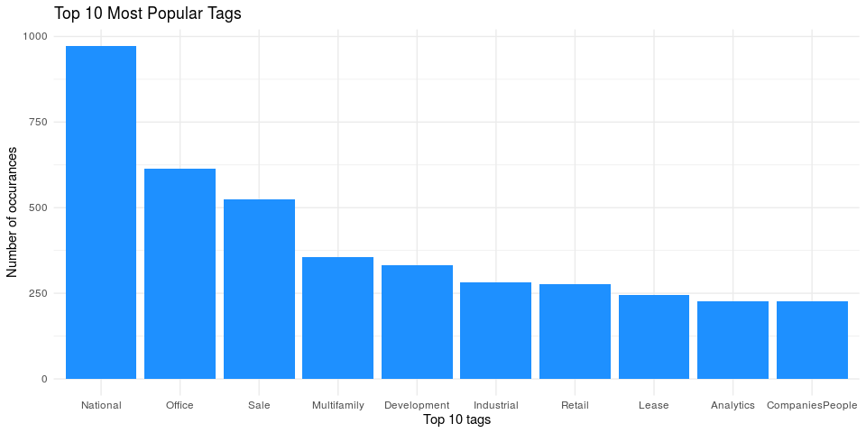
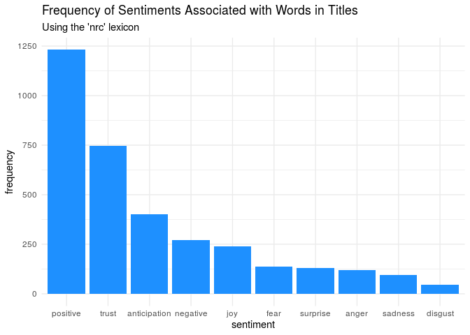

CoStar Data Analysis
================
Yi Chen, Daniel Hwang, Margaret Reed
10/12/19

## Reading the Data

``` r
data <- read.csv("data.csv") %>%
  as_tibble()
```

## Preliminary Cleanup

We needed to clean the data a little. We did so by coding the date
variable as a date using the `lubridate` package. We also resorted and
converted other values for ease of analysis.

``` r
data <- data %>%
  mutate(dateTime = ymd_hms(CreatedDate),
         Year = year(dateTime),
         Month = month(dateTime),
         Day = day(dateTime),
         Date = paste(Year, Month, Day, col = "-") %>% ymd() %>% as.Date()) %>%
  select(-dateTime, -Day, -Month, -Year) %>%
  select(Date, everything()) %>%
  mutate(Title = as.character(Title), 
         Summary = as.character(Summary),
         Body = as.character(Body))
```

## Visualizations

### Distributions

Below is our first visualization, showing the distribution of the
creation dates of the stories.

``` r
data %>%
  ggplot(aes(x = Date)) +
  geom_histogram(bins = 100, fill = "dodgerblue") +
  labs(x = "Date", y = "Number of stories", title = "Distribution of Creation Dates of Stories") +
  theme_minimal()
```

<!-- -->

Most of the stories seemed to be written in the latter half of 2018,
therefore we should look more closely at these dates.

``` r
data %>%
  filter(Date >= "2018-06-01") %>%
  ggplot(aes(x = Date)) +
  geom_histogram(bins = 100, fill = "dodgerblue") +
  labs(x = "Date", y = "Number of stories", title = "Distribution of Creation Dates after June 2018") +
  theme_minimal()
```

<!-- -->

The above data shows a cyclic weekly trend in the number of stories
created each week.

### Most Common Words

Here is a visualization of the most common words in the stories’ titles
overall.

``` r
textFreq <- data %>%
  select(Date, Title, StoryID) %>%
  unnest_tokens(word, Title) %>%
  anti_join(stop_words) %>%
  count(word, sort = TRUE)
```

    ## Joining, by = "word"

``` r
textFreq$word <- factor(textFreq$word, levels = textFreq$word[order(desc((textFreq$n)))])

textFreq %>%
  filter(n>= 75) %>%
  ggplot(aes(x = word, y = n)) +
    geom_col(fill = "dodgerblue") +
  labs(x = "Words", y = "Frequency", title = "Most Frequent Words in Titles") +
  theme_minimal()
```

<!-- -->

“Office” appears to be the most common word in all document titles.

Here is a visualization of the most common words in the summaries
overall.

``` r
textFreq <- data %>%
  select(Date, Summary, StoryID) %>%
  unnest_tokens(word, Summary) %>%
  anti_join(stop_words) %>%
  count(word, sort = TRUE)
```

    ## Joining, by = "word"

``` r
textFreq$word <- factor(textFreq$word, levels = textFreq$word[order(desc((textFreq$n)))])

textFreq %>%
  filter(n>= 150) %>%
  ggplot(aes(x = word, y = n)) +
    geom_col(fill = "dodgerblue") +
  labs(x = "Words", y = "Frequency", title = "Most Frequent Words in Summaries") +
  theme_minimal()
```

<!-- -->

“Market” appears to be the most common word in the document summaries.

### Tags

We decided to add up the number of tags each story had associated with
it. This took a little bit of work because each tag had their own column
with boolean values. They had to be gathered into a single column.

``` r
# condenses tags into one tags column and their boolean into hasTag
allTags <- gather(data, "tags", "hasTag", 13:35) 
allTags <- allTags[order(allTags$StoryID),]

# to find all tags associated with an article, filter for hasTag is true
allTags %>%
  filter(StoryID == 184098 & hasTag == 1) %>%
  select(Title, Date, tags)
```

    ## # A tibble: 6 x 3
    ##   Title                                            Date       tags         
    ##   <chr>                                            <date>     <chr>        
    ## 1 Hundreds of Localities Fortify Their Amazon HQ2… 2017-10-26 Tag_National 
    ## 2 Hundreds of Localities Fortify Their Amazon HQ2… 2017-10-26 Tag_Office   
    ## 3 Hundreds of Localities Fortify Their Amazon HQ2… 2017-10-26 Tag_Developm…
    ## 4 Hundreds of Localities Fortify Their Amazon HQ2… 2017-10-26 Tag_Finance  
    ## 5 Hundreds of Localities Fortify Their Amazon HQ2… 2017-10-26 Tag_Company  
    ## 6 Hundreds of Localities Fortify Their Amazon HQ2… 2017-10-26 Tag_Companie…

``` r
# creates a dataframe with story titles and their tag counts
tagCounts <- allTags %>%
  group_by(StoryID) %>%
  count(hasTag == 1) %>%
  select(StoryID, n) %>%
  rename(numTags = n)

# previous operation returns both true and false, removing all FALSE
toDelete <- seq(1, nrow(tagCounts), 2)
tagCounts <- tagCounts[-toDelete, ]

data <- data %>%
  full_join(tagCounts)
```

    ## Joining, by = "StoryID"

Since tags are one of the main drivers of webpage hits, we thought it
would be interesting to plot the number of tags each story has against
the number of hits the story got. We hypothesized that more tags would
lead to more hits on the story.

Below is a plot of the number of tags associated with each story and how
many hits it got.

``` r
# correlating number of tags with hit count
data %>%
  select(Hits, numTags) %>%
  ggplot(aes(numTags)) + 
  geom_bar(fill = "dodgerblue") + 
  scale_x_continuous(name = "Number of tags", breaks = seq(0, 8, 1)) +
  scale_y_continuous(name = "Hit count") + 
  theme_minimal() + 
  labs(title = "Number of Tags Correlated with Hit Count") 
```

<!-- -->

As it turns out, stories with 2 tags received the most hits. This result
is slightly unexpected.

### Tag Frequency

We also decided to visualize the top 10 most frequently occurring tags.

``` r
tagPop <- allTags %>%
  count(tags, hasTag) 

tagPop <- tagPop %>%
  filter(hasTag == 1) %>%
  arrange(n) %>%
  select(tags, n) %>%
  rename(total = n)

tagPop <- mutate_if(tagPop, 
                is.character, 
                str_replace_all, pattern = "Tag_", replacement = "")


tagPop %>%
  arrange(desc(total)) %>%
  slice(0:10) %>%
  ggplot(aes(x = reorder(tags, -total), y = total)) +
  geom_col(fill = "dodgerblue") + 
  scale_x_discrete(name = "Top 10 tags") +
  scale_y_continuous(name = "Number of occurances") + 
  theme_minimal() + 
  labs(title = "Top 10 Most Popular Tags")
```

<!-- -->

The “National” tag seems to be the most popular.

## Analysis

### Modeling

Below is a very basic multivariate linear regression model: most of tags
are involved in the model except for a few very infrequent ones.

``` r
data1 <- data %>%
  drop_na()

first_model <- lm(Hits ~ data1$numTags + Date + AuthorID + Country_USA + Country_CAN + Country_GBR + data1$Tag_None + data1$Tag_National + data1$Tag_Office + data1$Tag_Industrial + data1$Tag_Retail + data1$Tag_People + data1$Tag_Investment + data1$Tag_Analytics + data1$Tag_Development + data1$Tag_Finance + data1$Tag_Multifamily + data1$Tag_Hospitality + data1$Tag_Company + data1$Tag_Healthcare + data1$Tag_CompaniesPeople + data1$Tag_Lease + data1$Tag_Sale + data1$Tag_MixedUse + data1$Tag_SpecialPurpose, data = data1)

tidy(first_model)
```

    ## # A tibble: 25 x 5
    ##    term                 estimate std.error statistic  p.value
    ##    <chr>                   <dbl>     <dbl>     <dbl>    <dbl>
    ##  1 (Intercept)          5628.    2667.          2.11 3.49e- 2
    ##  2 data1$numTags         115.      30.2         3.81 1.45e- 4
    ##  3 Date                   -0.353    0.150      -2.35 1.88e- 2
    ##  4 AuthorID                0.157    0.0665      2.36 1.82e- 2
    ##  5 Country_USA           737.      59.4        12.4  5.07e-34
    ##  6 Country_CAN           497.      47.2        10.5  2.91e-25
    ##  7 Country_GBR           201.      64.9         3.09 2.00e- 3
    ##  8 data1$Tag_National    312.      35.4         8.80 3.01e-18
    ##  9 data1$Tag_Office      -64.1     32.5        -1.97 4.86e- 2
    ## 10 data1$Tag_Industrial -134.      34.4        -3.88 1.06e- 4
    ## # … with 15 more rows

``` r
glance(first_model)
```

    ## # A tibble: 1 x 11
    ##   r.squared adj.r.squared sigma statistic   p.value    df  logLik    AIC
    ##       <dbl>         <dbl> <dbl>     <dbl>     <dbl> <int>   <dbl>  <dbl>
    ## 1     0.475         0.469  242.      72.0 2.49e-246    25 -13344. 26740.
    ## # … with 3 more variables: BIC <dbl>, deviance <dbl>, df.residual <int>

### Sentiment Analysis

Below is a simple sentiment analysis performed on the titles of the
stories using the nrc lexicon.

``` r
textDataFreq <- data %>%
  select(Date, Title, StoryID) %>%
  unnest_tokens(word, Title) %>%
  inner_join(nrc) %>%
  group_by(sentiment) %>%
  summarize(totSents = n()) %>%
  arrange(desc(totSents))
```

    ## Joining, by = "word"

``` r
textDataFreq$sentiment <- factor(textDataFreq$sentiment, levels = textDataFreq$sentiment[order(desc((textDataFreq$totSents)))])

textDataFreq %>%
  ggplot(aes(x = sentiment, y = totSents)) +
  geom_col(fill = "dodgerblue") + 
  labs(x = "sentiment", y = "frequency", title = "Frequency of Sentiments Associated with Words in Titles", subtitle = "Using the 'nrc' lexicon") + 
  theme_minimal()
```

<!-- -->

Most of the titles seem to be positive.
